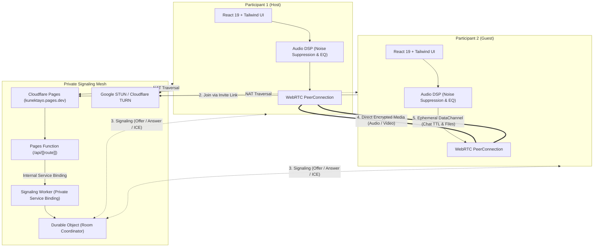
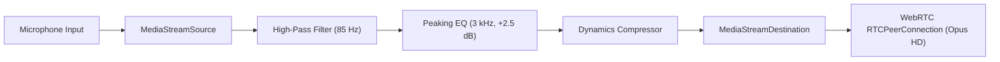

<div align="center">

  

  # KunekTayo

  <p><strong>Connect directly. Ephemeral by design.</strong></p>
  <p><em>Lightweight, temporary 1-on-1 private voice, video, and vanishing chat for Windows, Android, and Web.</em></p>

  <p>
    <a href="https://github.com/carlodandan/KunekTayo/releases"></a>
    <a href="#-tech-stack"></a>
    <a href="#-tech-stack"></a>
    <a href="#-automated-testing"></a>
    <a href="#-security--privacy-guarantees"></a>
    <a href="LICENSE"></a>
  </p>

  <p>
    <a href="#-features">Features</a> •
    <a href="#-architecture--topology">Architecture</a> •
    <a href="#-strict-7-color-design-system">Design System</a> •
    <a href="#-audio-processing-pipeline">Audio Pipeline</a> •
    <a href="#-getting-started">Getting Started</a> •
    <a href="#-production-builds">Building</a> •
    <a href="#-documentation">Documentation</a>
  </p>

</div>

---

## ⚡ Overview

**KunekTayo** (Filipino: *"Let us connect"*) is a zero-knowledge, zero-footprint communication utility built for private, momentary 1-to-1 conversations. 

In traditional platforms, every direct call and message leaves a persistent trail across databases, servers, and identity graphs. KunekTayo fundamentally eliminates that trail:
* **No user accounts, profiles, or cookies.**
* **Strict 2-participant limit enforced authoritatively at the server level.**
* **Zero server database, message logging, or call transcripts.**
* **Direct peer-to-peer audio, video, and screen sharing via WebRTC DTLS-SRTP.**
* **Automatic 30-minute self-destruct countdown for unclaimed rooms.**
* **Volatile in-memory room coordination destroyed instantly upon departure.**

---

## 🌟 Key Features

### 🔒 Privacy & Ephemeral Core
* **Authoritative 2-Person Ceiling**: Third-party connections receive an immediate HTTP 409 (`ROOM_FULL`) rejection.
* **Cryptographic Room Tokens**: 128-bit pseudorandom tokens (`crypto.getRandomValues`) validated with SHA-256 hashes and constant-time comparisons (`timingSafeEqual`).
* **30-Minute Solo Room TTL**: Unpaired rooms self-destruct after 30 minutes. Once both peers connect, the countdown cancels and the call stays active indefinitely.
* **Instant Destruction**: When both participants leave, the coordinator wipes all room state from volatile memory (`storage.deleteAll()`).

### 🎙️ Audio & Video Excellence
* **Web Audio DSP Noise Suppression**: Multi-stage audio processing graph filtering low-frequency rumble (85 Hz high-pass), elevating vocal presence (3 kHz peaking EQ), and balancing vocal dynamics.
* **Atomic Media Device Switching**: Seamlessly swap microphones, headphones, or cameras mid-call with zero connection drops. If a new hardware track fails, the existing stream is automatically retained.
* **Hardware Device Listener**: Automatically updates available microphones and cameras when USB or Bluetooth devices are plugged in or removed.
* **Adaptive Video Grid & PiP**: Fullscreen split-screen on desktop; responsive column layout with floating Picture-in-Picture (PiP) on mobile.

### 💬 In-Call Collaboration
* **Burning Ephemeral Chat**: In-memory text messaging over WebRTC `RTCDataChannel`. Messages feature selectable auto-purge timers (15s, 30s, 60s, or 5m) with visual burning countdowns.
* **Direct P2P Chunked File Sharing**: Send images and files directly to your peer in 32 KB chunks over encrypted DataChannels. Files exist only in volatile RAM Blobs and vanish upon closing the room.
* **Screen Sharing**: HD application and desktop screen sharing via `getDisplayMedia` with automatic camera fallback.

### 📱 Tailored Platform Experience
* **Native Apps (Windows & Android)**: Bypasses the marketing landing page and boots directly into the focused room workspace.
* **Web Client (`https://kunektayo.pages.dev`)**: Hosts the marketing overview with an instant segmented toggle into the web client.
* **Production Boundary**: System foundation diagnostics (`FoundationInfoCard`) are automatically stripped from production builds.

---

## 📊 Comparison Matrix

| Feature | KunekTayo | Discord | Zoom | WhatsApp |
| :--- | :---: | :---: | :---: | :---: |
| **User Accounts Required** | ❌ **No (Zero)** | ✅ Yes | ✅ Yes | ✅ Yes (Phone Number) |
| **Server Chat Logs** | ❌ **None (RAM Only)** | ✅ Yes | ✅ Yes | ⚠️ Stored on Device/Cloud |
| **Media Servers (SFU/MCU)** | ❌ **Direct P2P Mesh** | ✅ Yes | ✅ Yes | ⚠️ Hybrid |
| **Authoritative 2-Peer Cap** | ✅ **Strict 2/2** | ❌ Unlimited | ❌ Large Meetings | ❌ Group Cap |
| **Message Auto-Purge (TTL)** | ✅ **15s – 5m Burning** | ❌ No | ❌ No | ⚠️ 24h – 90d |
| **Data Retention on Exit** | ❌ **Zero (Wiped)** | ✅ Permanent | ✅ Account Logs | ⚠️ Permanent History |
| **Third-Party Server Exposure**| ❌ **Private Binding** | ⚠️ Public APIs | ⚠️ Public APIs | ⚠️ Centralized Meta |

---

## 🏗️ Architecture & Topology

KunekTayo uses a private signaling mesh to negotiate peer-to-peer sessions without exposing internal backend infrastructure:



---

## 🎨 Strict 7-Color Design System

KunekTayo’s visual interface is strictly confined to an authorized 7-color palette:

| Swatch | Color Hex | Role | Usage Rules |
| :---: | :--- | :--- | :--- |
|  | `#283E7C` | **Brand Primary** | Action buttons, local chat bubbles, interactive rings, focus states |
|  | `#9098C8` | **Lavender-Blue Accent** | Subheadings, verified badges, active icons, non-signal checkmarks |
|  | `#000000` | **Pure Black** | Deep video backdrop, modal scrims, OLED power efficiency |
|  | `#1E1F22` | **Dark Surface** | Application canvas, container cards, input backgrounds |
|  | `#DA373C` | **Danger Red** | **Leave Call / Hang Up button**, critical errors, poor ping (> 400ms) |
|  | `#1F332B` | **Signal Green** | **Gated exclusively to ping / connection quality and TLS locks.** |
|  | `#F0B232` | **Warning Yellow** | Ephemeral chat TTL countdowns, fair ping (200–400ms), room clocks |

> **Strict Color Invariants:**
> 1. **Green Rule**: `#1F332B` is **forbidden** for checkmarks, participant counters, or general UI icons. It is strictly reserved for live network ping and TLS security indicators.
> 2. **Call Termination**: The End Call action always uses `#DA373C`.
> 3. **No Blurple**: Legacy Discord blurple (`#5865f2` / `#4752c4`) is completely replaced by `#283E7C` and `#9098C8`.

---

## 🎧 Audio Processing Pipeline

Before audio frames are transmitted over WebRTC, the browser audio stream passes through a specialized Web Audio API processing graph:



* **85 Hz High-Pass Filter**: Completely cuts desk thumps, HVAC hum, and handling rumble.
* **3 kHz Peaking EQ (+2.5 dB, Q=1.2)**: Enhances vocal consonant clarity and presence.
* **Dynamics Compressor**: Smooths sudden audio spikes (ratio 4:1, threshold -24 dB) and raises whispered speech.
* **Hardware Constraints**: Activates native `noiseSuppression`, `echoCancellation`, and `autoGainControl`.

---

## 🛠️ Tech Stack

| Layer | Technology | Version | Purpose |
| :--- | :--- | :--- | :--- |
| **Desktop Shell** | [Tauri](https://v2.tauri.app/) | `v2.12` | Native Windows windowing, deep links, tray, auto-updater |
| **Mobile Shell** | [Tauri Mobile](https://v2.tauri.app/) | `v2.12` | Native Android APK/AAB wrapper, camera/mic permissions |
| **Frontend Framework** | [React](https://react.dev/) | `v19.3` | UI components, concurrency, state management |
| **Language** | [TypeScript](https://www.typescriptlang.org/) | `~6.0` | Strict type safety, contracts, and interfaces |
| **Styling** | [Tailwind CSS](https://tailwindcss.com/) | `v4.3` | Utility-first CSS, custom OLED tokens |
| **Icons** | [Phosphor Icons](https://phosphoricons.com/) | `^2.1` | Vector SVGs, touch targets $\ge 48\text{dp}$ |
| **Signaling & Edge** | [Cloudflare Workers](https://workers.cloudflare.com/) + [DO](https://developers.cloudflare.com/durable-objects/) | Latest | Authoritative 1-on-1 state, 30m solo room alarm |
| **Web Hosting** | [Cloudflare Pages](https://pages.cloudflare.com/) | Latest | Static hosting, `/api/*` private Service Binding |
| **P2P Protocols** | WebRTC (`RTCPeerConnection`, `RTCDataChannel`) | Standard | DTLS-SRTP audio/video, SCTP ephemeral data |
| **Test Runner** | [Vitest](https://vitest.dev/) | `v5.0` | 38 unit & integration tests across 8 test suites |

---

## 🚀 Getting Started

### Prerequisites

* **Node.js**: `v22` (or $\ge 20$)
* **PNPM**: `v11` (or $\ge 9$) — `npm install -g pnpm`
* **Rust Toolchain**: `rustup default stable`
* **Windows Build Tools**: Visual Studio 2022 with *Desktop Development with C++*
* **Android Tools** (optional for local Android builds): Java 17 JDK, Android SDK (API 34), NDK `27.0.11902837`

### Quick Start

```bash
# 1. Clone repository
git clone https://github.com/carlodandan/KunekTayo.git
cd KunekTayo

# 2. Install dependencies
pnpm install

# 3. Start web development server (http://localhost:1420)
pnpm dev

# 4. Launch native desktop development app (Windows)
pnpm tauri dev

# 5. Run test suite
pnpm test
```

---

## 📦 Production Builds

### 1. Windows Desktop Installers (`.exe` & `.msi`)

```bash
# Typecheck and compile frontend bundle
pnpm build

# Build Windows NSIS installer and MSI package
pnpm tauri build
```
Generated artifacts:
* `src-tauri/target/release/bundle/nsis/KunekTayo_1.0.0_x64-setup.exe`
* `src-tauri/target/release/bundle/msi/KunekTayo_1.0.0_x64_en-US.msi`

### 2. Android Mobile Package (`.apk`)

```bash
# Initialize Android workspace (first time only)
pnpm tauri android init

# Build release APK
pnpm tauri android build --apk
```
Generated artifact:
* `src-tauri/gen/android/app/build/outputs/apk/release/app-release-unsigned.apk`

### 3. Web Client & Cloudflare Pages

```bash
# Build production SPA bundle
pnpm build

# Deploy directly via Wrangler
npx wrangler pages deploy dist --project-name kunektayo
```

### 4. Signaling Worker Backend

```bash
cd server
pnpm install
pnpm run deploy
```
*Note: In Cloudflare Pages Settings &rarr; Functions, add the `SIGNALING` Service Binding to `kunektayo-signaling` and turn OFF `workers.dev` to make the backend completely private.*

---

## 🛡️ Security & Privacy Guarantees

1. **Zero-Knowledge Token Architecture**: Plaintext invite tokens never touch the server. Only SHA-256 hashes are transmitted and compared using constant-time `timingSafeEqual`.
2. **Backend Server Isolation**: The signaling worker has no public URL; all requests proxy over Cloudflare's private internal memory bus via Service Bindings.
3. **End-to-End Encryption**: DTLS-SRTP secures all media; SCTP-over-DTLS secures data channels.
4. **Rate Limiting & Flood Shield**: Sliding-window IP rate limiting (15 room creates/min, 30 joins/min) and 30 msgs/s WebSocket message caps.
5. **Auto-Reconnection**: Exponential backoff signaling recovery and automatic ICE restarts (up to 3 retries) on network interruption.

---

## 🧪 Automated Testing

All suites are run via Vitest:
```bash
pnpm test
```

Current test status:
```text
 ✓ src/utils/__tests__/crypto.test.ts (8 tests)
 ✓ src/services/__tests__/audioProcessing.test.ts (4 tests)
 ✓ src/services/__tests__/deviceSwitching.test.ts (10 tests)
 ✓ src/components/chat/__tests__/ephemeralChat.test.ts (3 tests)
 ✓ src/components/room/__tests__/pictureInPicture.test.ts (4 tests)
 ✓ src/services/__tests__/deepLinkService.test.ts (5 tests)
 ✓ src/components/layout/__tests__/headerGating.test.tsx (2 tests)
 ✓ src/components/room/__tests__/foundationInfoCard.test.ts (2 tests)

 Test Files  8 passed (8)
      Tests  38 passed (38)
```

---

## 📚 Documentation

Detailed specifications and engineering runbooks are maintained in the [`project/`](project/) directory:

* 📐 [Architecture Documentation](project/ARCHITECTURE.md) — System topology, WebRTC state machines, audio pipelines, and edge mesh.
* 🎨 [UI/UX Design System](project/DESIGN_SYSTEM.md) — 7-color palette, touch target specifications, and typography.
* 📋 [Technical Specifications](project/SPEC.md) — Data contracts, REST endpoints, and DataChannel schemas.
* 🔒 [Security & Reliability Specification](project/SECURITY.md) — Threat model, cryptographic primitives, and rate limiting.
* 🚀 [Production Deployment Runbook](project/DEPLOYMENT.md) — Step-by-step deployment guide for Windows, Android, and Cloudflare.
* 🗺️ [Project Roadmap](project/ROADMAP.md) — Implementation phase tracker and milestone progress.

---

## 📄 License

This project is licensed under the [MIT License](LICENSE) © 2026 [Carlo Dandan](https://github.com/carlodandan).
