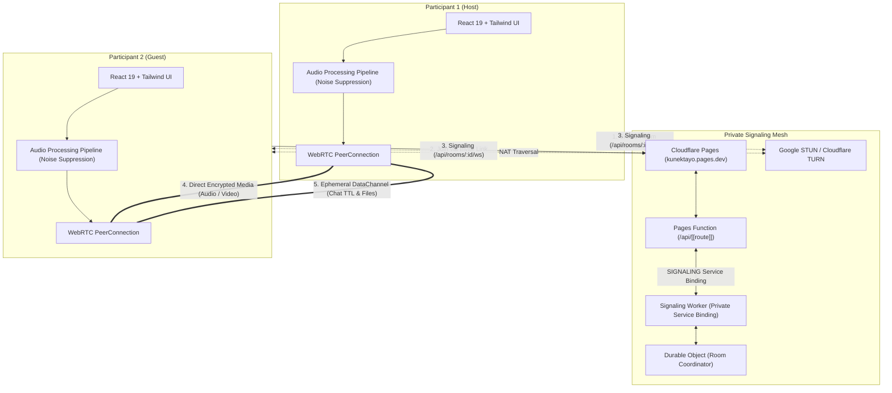
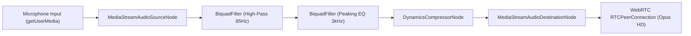
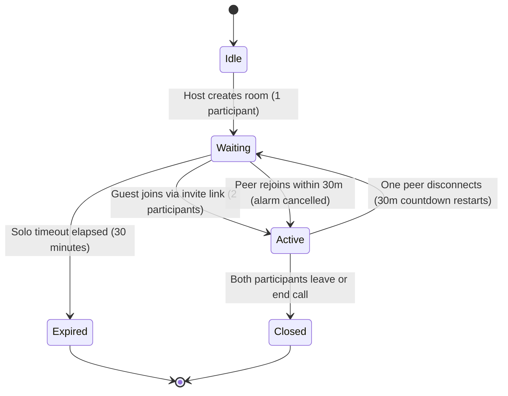

# KunekTayo — Architecture Documentation

KunekTayo is a lightweight, temporary, 1-to-1 communication application for **Windows**, **Android**, and **Web**, engineered with **Tauri 2**, **React 19**, **Vite 8**, **Tailwind CSS v4**, and **WebRTC P2P**, coordinated by a **Cloudflare Pages, Workers & Durable Objects** zero-knowledge signaling mesh.

---

## 1. System Overview & Core Philosophy

> **Product Principle:** Create a room. Send the link. Connect with one person. Talk privately. Leave with zero trace.

* **Strict 1-to-1 Limitation**: Exactly 2 participants maximum per room enforced authoritatively at the server level.
* **Zero User Accounts**: No usernames, passwords, cookies, or persistent identity records. Authentication relies on volatile 128-bit cryptographic tokens.
* **Direct P2P Media Mesh**: Audio, video, and screen sharing flow directly between peer devices over encrypted WebRTC DTLS-SRTP channels.
* **Transient Room Storage**: SQLite-backed Durable Object storage holds room coordination state and alarms, with no long-term user-content records, transcripts, or media recording. The final participant’s departure immediately clears room state (`storage.deleteAll()`); when one participant remains, a 30-minute reconnect grace period applies.
* **Platform-Adaptive UX**:
  * **Native Apps (Windows & Android)**: Bypasses the marketing landing page and boots directly into the in-call or room creation workspace.
  * **Web Client**: Provides both the marketing overview and full web calling application with an instant toggle.
* **Production Boundary**: Internal system and foundation diagnostics (`FoundationInfoCard`) are automatically stripped in production builds.

---

## 2. Architecture Diagram

---

## 3. Technology Stack Breakdown

| Layer | Technology | Primary Function |
| :--- | :--- | :--- |
| **Desktop Shell** | Tauri 2.12 (Rust MSVC) | Native Windows windowing, MSI/NSIS packaging, tray & deep links |
| **Mobile Shell** | Tauri 2.12 (Rust Android NDK) | Native Android activity, APK/AAB packaging, camera/mic permissions |
| **Frontend Framework** | React 19.3 + TypeScript 6.0 | Reactive component architecture, hooks, state orchestration |
| **Styling & Design** | Tailwind CSS v4 | Strict 7-color palette, OLED dark mode, responsive layout |
| **Icons** | Phosphor Icons (`@phosphor-icons/react`) | Vector icons, touch targets $\ge 48\text{dp}$ |
| **Bundler & Tooling** | Vite 8.3 + Rolldown | High-speed HMR, asset compilation, chunk minification |
| **Signaling & Edge** | Cloudflare Workers + Durable Objects | Authoritative 1-on-1 coordination, 30m solo room alarm |
| **Web Hosting** | Cloudflare Pages + Pages Functions | Static asset delivery, `/api/*` internal service binding routing |
| **Media Transport** | WebRTC (`RTCPeerConnection`) | DTLS-SRTP encrypted peer-to-peer audio and video |
| **Audio Processing** | Web Audio API (`BiquadFilter`, `DynamicsCompressor`) | Noise suppression, high-pass rumble filter, voice presence EQ |
| **Data Transport** | WebRTC `RTCDataChannel` | Ephemeral burning chat (15s–5m TTL) and chunked file transfer |
| **Testing** | Vitest 5.0 | Unit and integration test suites |

---

## 4. Audio Processing Pipeline

KunekTayo features a multi-stage Web Audio API processing graph designed to suppress ambient background noise and enhance vocal clarity before transmission:

1. **High-Pass Filter (85 Hz)**: Cuts low-frequency HVAC rumble, desk vibrations, and handling thumps.
2. **Presence Peaking Filter (3 kHz, +2.5 dB, Q=1.2)**: Elevates speech consonants for intelligibility without harshness.
3. **Dynamics Compressor**: Smooths loud vocal spikes (ratio 4:1, threshold -24 dB) and elevates softer speech.
4. **Hardware Constraints**: Requests native `noiseSuppression: true`, `echoCancellation: true`, and `autoGainControl: true` from the audio hardware driver.

---

## 5. Media Device Switching Architecture

To ensure uninterrupted calls when switching audio inputs, headphones, or webcams:
* **Atomic Replacement**: `replaceAudioTrack` and `replaceVideoTrack` query `RTCRtpSender.replaceTrack`.
* **Zero Interruption**: The existing track remains active until the new track is confirmed operational. If negotiation fails, the new track is disposed of and the existing track is seamlessly retained.
* **Hardware Listener**: Tracks `navigator.mediaDevices.ondevicechange` to dynamically refresh available audio and video devices without restarting the room.

---

## 6. Android Native Picture-in-Picture & Background Calling Architecture

To achieve parity with native Android communication applications (WhatsApp, Google Meet, Discord):
1. **OS-Level Picture-in-Picture (PiP)**:
   * Enabled via `android:supportsPictureInPicture="true"` on `MainActivity`.
   * On Android 12+ (API 31+), `PictureInPictureParams.Builder.setAutoEnterEnabled(true)` seamlessly transitions the call into a floating mini-window on gesture/home swipes.
   * On Android 8.0–11, `onUserLeaveHint()` intercepts background navigation and calls `enterPictureInPictureMode()`.
   * Dispatches `android:pip-changed` events to React, hiding controls and rendering video full-bleed in the floating window.
2. **Foreground Calling Service (`CallNotificationService`)**:
   * Uses `android:foregroundServiceType="microphone"` with `FOREGROUND_SERVICE_MICROPHONE` permission, ensuring Android does not cut the microphone or throttle CPU.
   * Posts an ongoing system notification (*"KunekTayo Call in Progress"*) with single-tap return to the live call.
3. **WebView Unpause Guard**:
   * `MainActivity.onPause()` invokes `webView.onResume()` during active calls or PiP mode, guaranteeing WebRTC media threads, audio output, and video rendering stay unthrottled.

---

## 7. Room Lifecycle State Machine

### Expiration Invariants
1. **Solo Room Timeout**: An unjoined room runs an authoritative 30-minute timer. If no second peer joins, the room self-destructs.
2. **Active Call Longevity**: When both participants are connected, the timer cancels and the room stays active indefinitely.
3. **Disconnection Grace**: If one participant drops, a 30-minute grace window begins. If they reconnect, the call continues seamlessly.
4. **Third-Party Rejection**: Any attempt by a 3rd party to enter an active room returns HTTP 409 / WebSocket `ROOM_FULL`.

---

## 7. Ephemeral Chat & DataChannel Architecture

* **Channel Label**: `"ephemeral-chat"`.
* **Independent TTL**: Configurable auto-purge durations: 15s, 30s, 60s, or 5m.
* **Storage**: In-memory array on client devices only. Messages never touch any server or database.
* **Local Purge**: Client-side timers automatically evaporate messages once their TTL countdown hits zero.
* **Direct File Sharing**: Files are chunked into 32 KB blocks, transferred over `RTCDataChannel`, assembled into RAM Blobs, and revoked on session exit.
