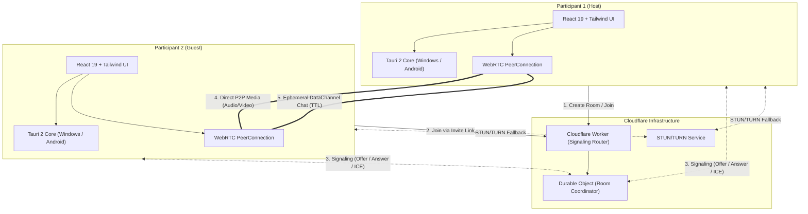
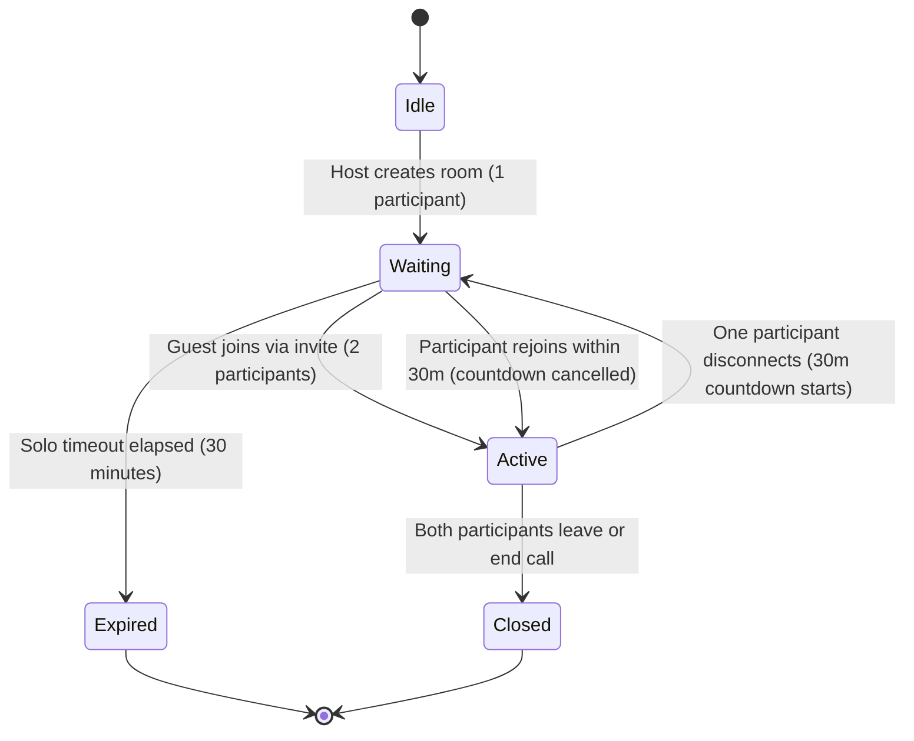

# KunekTayo — Architecture Documentation

KunekTayo is a lightweight, temporary, 1-to-1 communication desktop and mobile application for **Windows** and **Android**, built with **Tauri 2**, **React 19**, **Vite**, **Tailwind CSS**, and **WebRTC P2P**, with **Cloudflare Workers & Durable Objects** for signaling and authoritative room state.

---

## 1. System Overview & Core Philosophy

> **Product Principle:** Create a room. Send the link. Connect with one person. Talk privately.

* **Strict 1-to-1 limitation**: Exactly 2 participants maximum per room.
* **No traditional user accounts**: Ephemeral session tokens; zero persistent user profiles.
* **Direct P2P Media**: Audio and video flow directly between peers via WebRTC.
* **Authoritative Ephemeral State**: Cloudflare Durable Objects track participant counts, heartbeats, and room expiration without persisting conversational data.
* **Zero Footprint**: Ephemeral chat operates over WebRTC DataChannels with local TTL-based auto-purging.

---

## 2. Architecture Diagram (Mermaid)

---

## 3. Technology Stack Breakdown

| Layer | Technology | Responsibility |
| :--- | :--- | :--- |
| **Desktop / Mobile Shell** | Tauri 2.12 (Rust) | Native Windows and Android windowing, OS media permissions, deep linking |
| **Frontend Framework** | React 19.3 + TypeScript 6.0 | Reactive UI components, state management, audio/video rendering |
| **Bundler & Build Tool** | Vite 8.3 | Ultra-fast HMR, asset compilation, native modern bundler |
| **Design & Styling** | Tailwind CSS v4 + Phosphor Icons | Accessible dark-mode system, >=48dp touch targets, responsive layout |
| **Media & P2P Transport**| WebRTC standard (RTCPeerConnection) | Opus audio, VP8/H.264 video, RTCDataChannel for ephemeral chat |
| **Signaling & Room State** | Cloudflare Workers + Durable Objects | WebSocket signaling, room coordination, 30m solo room expiration |
| **NAT Traversal** | Google STUN + Production TURN | ICE candidate gathering, firewall penetration, relay fallback |

---

## 4. Room Lifecycle State Machine

### Expiration Invariants
1. **Solo Room Expiration**: When only 1 participant is in a room, a strict **30-minute timer** runs. If no second peer joins, the room is deleted.
2. **Active Room Longevity**: While both participants are connected, the room remains alive indefinitely.
3. **Disconnection Handling**: If one participant drops, the 30-minute grace period restarts. If they reconnect, the timer is cleared.
4. **Third-Party Rejection**: Any attempt by a 3rd party to join returns HTTP 409 / WebSocket `ROOM_FULL`.

---

## 5. Ephemeral Chat Architecture

* **Transport**: Direct WebRTC `RTCDataChannel` labeled `"ephemeral-chat"`.
* **Lifespan**: Completely decoupled from room lifespan.
* **Message TTL**: Default **60 seconds** (configurable 10s – 600s).
* **Storage**: In-memory only on client devices. No chat messages ever hit the server or database.
* **Auto-Purge**: Reactive client timer schedules removal of each message upon TTL expiration.

---

## 6. Security and Privacy Model

1. **Cryptographic Room Tokens**: 16-byte cryptographically secure pseudo-random tokens generated via `crypto.getRandomValues`.
2. **Zero Permanent Storage**: No user database, no message logging, no call recordings.
3. **End-to-End Encryption**: DTLS-SRTP for all audio/video streams, DTLS for RTCDataChannel.
4. **Local Isolation**: Tauri security boundaries enforce CSP, preventing unwanted external code injection.
