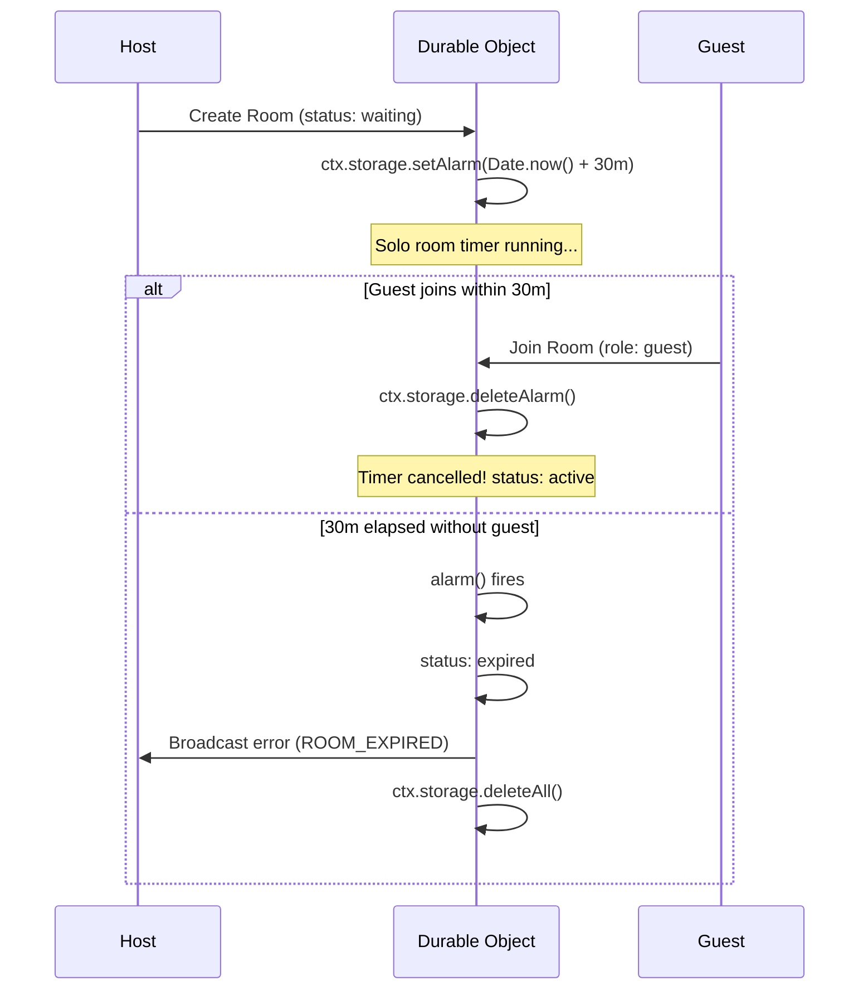

# KunekTayo — Technical Specifications

This document defines the technical data contracts, signaling schemas, and runtime specifications for KunekTayo.

---

## 1. Room Protocol Specifications

### Room Constraints
* **Capacity Limit**: Exactly 2 participants (`host`, `guest`).
* **Solo Room TTL**: `1,800,000 ms` (30 minutes) from room initialization or when participant count drops to 1.
* **Token Entropy**: 128-bit cryptographically secure random value (`crypto.getRandomValues`).
* **Room Identifier Format**: Hexadecimal lowercase string (`8 bytes` = 16 hex characters).
* **Invite Token Format**: Hexadecimal lowercase string (`16 bytes` = 32 hex characters).
* **Invite Token Storage**: SHA-256 hash stored on server (`inviteTokenHash`), never raw token.

### Cloudflare Durable Object Room State
```typescript
interface DurableRoomState {
  roomId: string;
  inviteTokenHash: string;
  status: "waiting" | "active" | "expired" | "closed";
  participants: Array<{
    id: string;
    role: "host" | "guest";
    joinedAt: number;
    lastPingAt: number;
  }>;
  soloExpiresAt: number | null;
  createdAt: number;
}
```

---

## 2. Room REST API & Worker Endpoints

> **Routing Note:** In production, all `/api/*` REST endpoints and WebSocket upgrades (`/api/rooms/:roomId/ws`) are proxied internally via the Cloudflare Pages Function (`functions/api/[[route]].ts`) using the private `SIGNALING` Service Binding. Clients call same-origin paths (`/api/...`), completely concealing the underlying worker infrastructure.

### `POST /api/rooms`
Creates an authoritative room instance within a dedicated Cloudflare Durable Object.
* **Request Body**:
  ```json
  {
    "roomId": "e8a93b48f01c456a",
    "inviteTokenHash": "9b71d224bd62f3785d96d46ad3ea3d73319bfbc2890caadae2dff72519673ca7",
    "hostParticipantId": "p_c01928374a5e"
  }
  ```
* **Response (201 Created)**:
  ```json
  {
    "success": true,
    "state": {
      "roomId": "e8a93b48f01c456a",
      "status": "waiting",
      "participants": [{ "id": "p_c01928374a5e", "role": "host", "joinedAt": 1728300000000 }],
      "soloExpiresAt": 1728301800000,
      "createdAt": 1728300000000
    }
  }
  ```

### `GET /api/rooms/:roomId?tokenHash=:tokenHash`
Validates access and returns current room status.
* **Response (200 OK)**:
  ```json
  {
    "roomId": "e8a93b48f01c456a",
    "status": "waiting",
    "participantCount": 1,
    "canJoin": true,
    "soloExpiresAt": 1728301800000,
    "createdAt": 1728300000000
  }
  ```
* **Errors**: `403 INVALID_TOKEN`, `404 ROOM_EXPIRED`

### `POST /api/rooms/:roomId/join`
Attempts to join a room as the second participant (`guest`).
* **Request Body**: `{ "participantId": "p_guest123", "inviteTokenHash": "..." }`
* **Success (200 OK)**:
  Cancels the 30-minute solo alarm, sets `status = "active"`, returns `{ role: "guest", state: ... }`.
* **Errors**:
  - `409 ROOM_FULL`: Third participant attempted to join.
  - `403 INVALID_TOKEN`: Token hash does not match room.
  - `410 ROOM_EXPIRED`: Room closed after 30 minutes of inactivity.

### `POST /api/rooms/:roomId/leave`
Notifies server that a participant has left.
* If 1 participant remains: Restarts 30-minute solo countdown (`ctx.storage.setAlarm`).
* If 0 participants remain: Deletes Durable Object storage (`ctx.storage.deleteAll()`).

---

## 3. Authoritative Alarm & Expiration Handling



---

## 4. Ephemeral Chat DataChannel Specification

* **Channel Label**: `"ephemeral-chat"`
* **Ordered**: `true`
* **Max Packet Lifetime**: `3000 ms`

### Message Packet Schema
```typescript
interface DataChannelMessage {
  id: string;             // UUIDv4
  senderId: string;       // Participant ID
  text: string;           // UTF-8 encoded text (max 2000 chars)
  timestamp: number;      // Unix epoch (milliseconds)
  ttlSeconds: number;     // Configured TTL (e.g. 60s)
}
```

---

## 5. Deep Linking & URL Schemas

* Web URL: `https://kunektayo.app/#room=<ROOM_ID>&token=<TOKEN>`
* Windows Protocol: `kunektayo://join?room=<ROOM_ID>&token=<TOKEN>`
* Android App Link: `https://kunektayo.app/join/:roomId#token`
